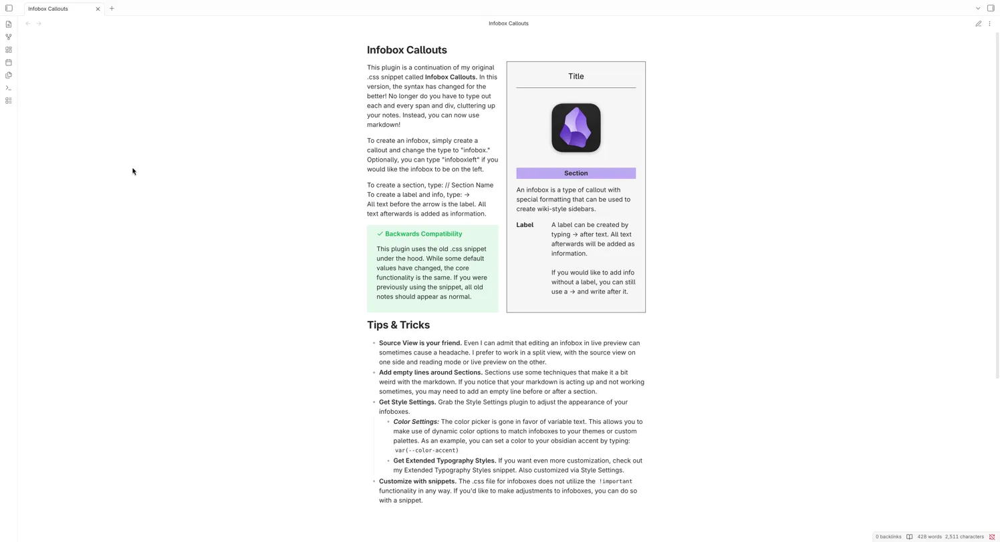
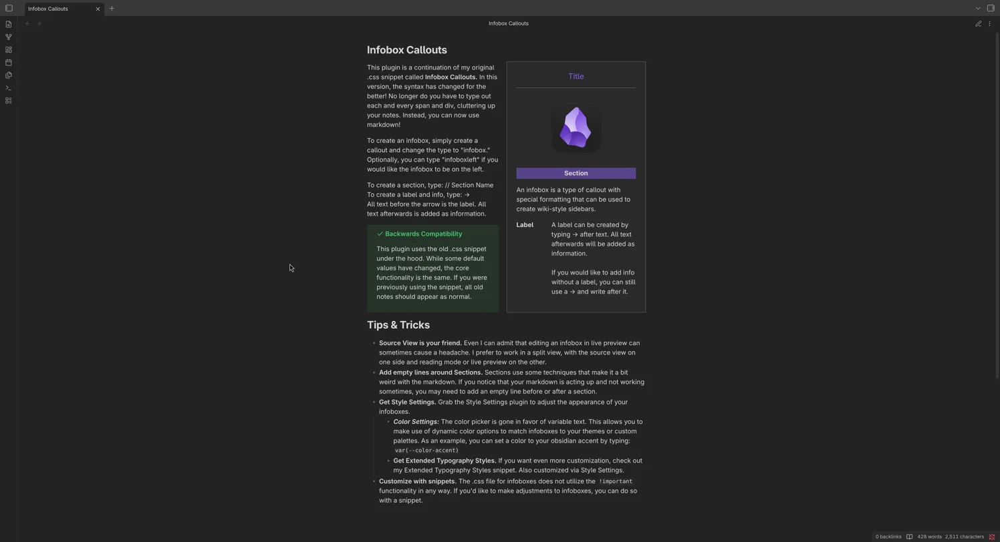

# How to Use
Insert a callout and change the type to "infobox." Alternatively, you can type "infoboxright" (alias of infobox) or "infoboxleft" if you want it aligned to the left side of the document.

To add a section, use two slashes within the callout. `// insert section name`

To add a label, use an arrow after the label title. `Label Name -> Add information here`

If you want to add information without a label, you can use an arrow without text beforehand. `-> Add text here`

Any content added after the callout will be rendered beside it or below it.

# How to Install
This plugin is not yet on the community plugins browser, however it can still be installed and updated via the BRAT plugin.

1. Enable Community plugins in obsidian and install the BRAT plugin. Enable it.
2. Open the BRAT plugin options and scroll down to "Beta plugin list"
3. Click add beta plugin
4. Copy and paste this repository's URL into the window that appears
5. Select latest version
6. Click Add Plugin

## How to Customize
1. Install and enable Style Settings from the community plugins.
2. In the Style Settings menu, a new section called "Infoboxes" will be added. Click on it to reveal customization options.


# What if I used the snippet version?
This plugin uses the same classes that the snippet does under the hood. If you previously used the snippet version, all your old notes should still appear as infoboxes without needed modifications. (Message me if this is not the case for you and I'll look into it to see if it's my fault). There are some differences however, mostly in the appearance settings.

Do note, you will likely have to reconfigure your settings if you modified them via style settings.

## What's different from the snippet?
For starters, you no longer have to type html classes, cluttering up your notes. Use // to create a section. To create a label, type the name of the label, then type -> to add information.

The default appearance has changed. Gone is my weird, yet somewhat whimsical, green preset. The new defaults match the default obsidian theme quite a bit better.

The color selectors are gone in favor of variable text. Personally, I found the color selectors to be a bit difficult to use. This allows you to have more flexibility in customizing your infoboxes, including using variables such as `var(--color-accent)` if you want something more dynamic.


# EXAMPLE
_Copy and paste into a document to see it in action._

```
> [!infobox] Title
> ---
> 
> 
> // Section
> 
> An infobox is a type of callout with special formatting that can be used to create wiki-style sidebars.
> 
> Label -> A label can be created by typing -> after text. All text afterwards will be added as information.
> -> If you would like to add info without a label, you can still use a -> and write after it.
```

# Tips & Tricks

- **Source View is your friend.** Even I can admit that editing an infobox in live preview can sometimes cause a headache. I prefer to work in a split view, with the source view on one side and reading mode or live preview on the other.
  
- **Add empty lines around Sections.** Sections use some techniques that make it a bit weird with the markdown. If you notice that your markdown is acting up and not working sometimes, you may need to add an empty line before or after a section.

- **Get Style Settings.** Grab the Style Settings plugin to adjust the appearance of your infoboxes.
  
	- ***Color Settings:*** The color picker is gone in favor of variable text. This allows you to make use of dynamic color options to match infoboxes to your themes or custom palettes. As an example, you can set a color to your obsidian accent by typing:
	 `var(--color-accent)`
	
	- **Get Extended Typography Styles.** If you want even more customization, check out my Extended Typography Styles snippet. Also customized via Style Settings.


# Still in Early Development

## What I want to know most
Lemme know how the syntax works out for you. I couldn't get it to break. Maybe you can. I tried everything I could think of that uses an -> and // in their syntax and I couldn't find one that conflicts with my implementation yet. Lemme know if you find anything and if I gotta change something. But I'd hate to change to an uglier set of symbols.
	
- **Customize with snippets.** The .css file for infoboxes does not utilize the `!important` functionality in any way. If you'd like to make adjustments to infoboxes, you can do so with a snippet.
